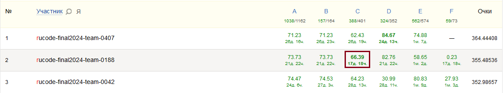
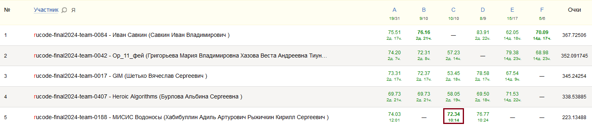

# Rucode Final 2024, лига "Продвинутые" (1 место)

*МИСИС Водоносы team*

Team Members:

1. **Рыжичкин Кирилл** - ML
2. **Хабибуллин Адиль** - ML

## Задача C: Обретение жанра 

> Представьте себе будущее, где внезапный сбой на крупнейшем кинохостинге обернулся настоящей катастрофой для киноманов по всему миру — база данных с жанрами фильмов была повреждена. Восстановить удалось лишь часть информации, но тысячи описаний остались без жанровой принадлежности. Ваше задание — разработать алгоритм искусственного интеллекта, который станет цифровым детективом, способным по одному лишь описанию фильма восстановить его жанры. Модель должна будет не просто механически классифицировать данные, но и понимать тонкие нюансы и контексты, отличающие триллер от драмы, а комедию от фэнтези.

## Решение
- DoRA адаптер для base-модели `unsloth/gemma-2-9b-it-bnb-4bit`
- `max_lenght` 1024 при обучении и 2048 при инференсе
- 2 эпохи
- 8 первых слоев заморожено
- (`lora_rank`, `lora_alpha`) = (32, 64)
- модули `q_proj`, `k_proj`, `v_proj`, `gate_proj`, `up_proj`, `down_proj`
- `iterative_train_test_split` для валидационного сплита
- указание весов классов в `binary_cross_entropy_with_logits`

## Ноутбуки

- [Train](rucode-c-train.ipynb) - обучение DoRA адаптера для `unsloth/gemma-2-9b-it-bnb-4bit`
- [Inference](rucode-c-inference.ipynb) - инференс модели

## Метрики

Валидация:
- f1-micro: 0.73
- f1-macro: 0.67
- f1-weighted: 0.71

Публичный лидерборд:
- f1-macro: 0.66 (топ-1)

Приватный лидерборд:
- f1-macro: 0.72 (топ-1)

